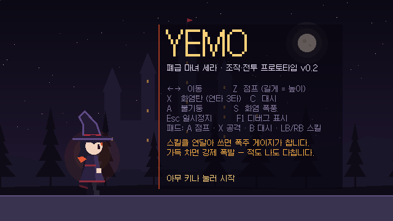
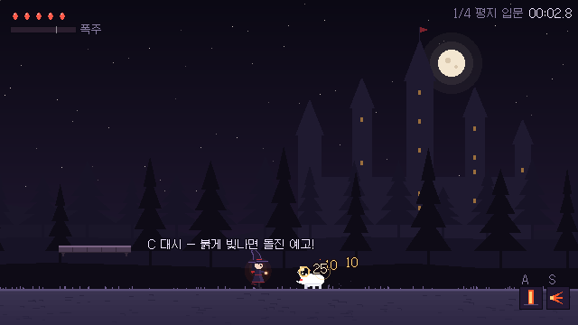
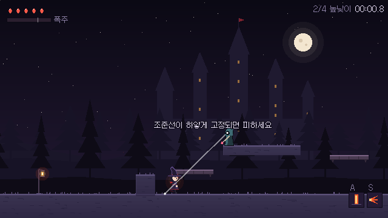
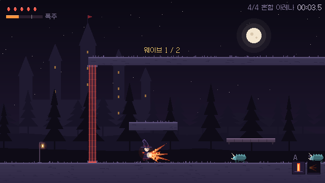
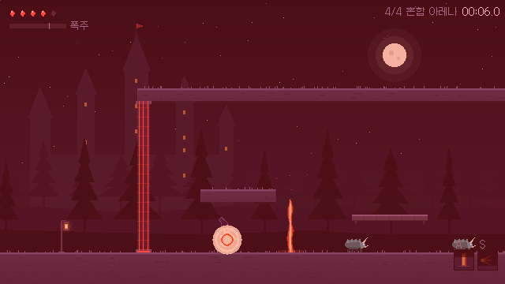
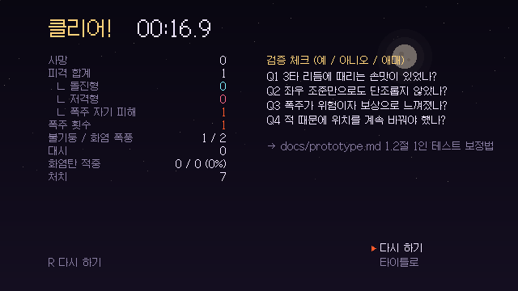

# 프로토타입 v0.2 — 한 번의 명령으로 만든 조작·전투 프로토타입

> 기획: [`prototype.md`](../archive/sera/prototype.md) (13절 구현 보완 명세) · 실행: [`game/README.md`](../../game/README.md)
> 목표: "출시 가능한 게임의 60% 수준, 아트는 코드로 그릴 수 있는 한도까지" (2026-10-03 요청)



---

## 1. 결과 요약

| 기획서 범위 (2절) | 구현 | 비고 |
|---|---|---|
| 이동, 1단 가변 점프, 공중 사격 | ✅ | 코요테 타임·점프 버퍼, 착지·달리기 먼지, 늘림·찌그러짐 |
| 대시(짧은 무적) | ✅ | 잔상 3개, 무적 중 밝아짐, 공중 1회 |
| 화염탄 3타 리듬 | ✅ | 가늘고 긴 탄 + 꼬리, 3타 반동, 피해 숫자 |
| 스킬: 발밑 불기둥 | ✅ | 바닥 균열 예고 → 분출, 적 띄우기, 예고 중 대상 추적 |
| 스킬: 화염 폭풍 (전방 부채꼴) | ✅ | 3회 피해, 돌진 끊기, 마지막 타격에 큰 넉백 |
| 폭주 게이지 + 강제 폭발 | ✅ | 머리끝 발광·깜빡임, 경고 웅웅거림, 화면 붉은 테두리, 자기 피해·경직 |
| 적: 돌진형 | ✅ | 순찰 → 감지 → 붉은 예고 → 돌진 → 어지러움 |
| 적: 저격형 | ✅ | 추적 조준선 → 흰색 고정(깜빡임) → 발사 → 재장전 |
| 체력 5칸, 피격, 사망, 재시작 | ✅ | 사망 시 슬로모션 → 마지막 체크포인트에서 재시작 |
| 타격감 연출 (5.8절) | ✅ | 히트스톱·화면 흔들림·흰색 깜빡임·넉백, 수치는 표 그대로 |
| 4구간 약 5분 레벨 | ✅ | 평지 입문 → 높낮이 → 돌진형 무리 → 혼합 아레나(2웨이브) → 출구 |
| 결과 화면 | ✅ | 시간·사망·원인별 피격·폭주·스킬·대시·적중률·처치 + 검증 질문 |
| HUD, 일시정지 | ✅ | 체력·폭주 게이지·스킬 재사용 대기·구간·시간 / 계속·체크포인트·처음·타이틀 |
| 임시 효과음 6종 이상 | ✅ | 코드로 합성한 효과음 26종 |
| Q5 픽셀 높이 비교 | ⏸ 연기 | 코드 그래픽이라 비교 의미 없음 → 픽셀 아트 단계에서 (13.1절) |



## 2. 플레이 방법

- **브라우저**: https://abback-go.github.io/yemo_plan/ (Pages 설정을 켠 경우)
- **Godot 에디터**: 함께 전달한 ZIP을 풀고 `yemo_game/project.godot` 가져오기 → F5
- **연습 방**: 에디터에서 `levels/test_room.tscn`을 열고 F6 — 계단 1~4T, 돌진형, 저격형으로 수치 조정용

| 조작 | 키보드 | 패드 |
|---|---|---|
| 이동 / 점프 / 공격 / 대시 | ←→ / Z / X / C | 스틱 / A / X / B·RT |
| 불기둥 / 화염 폭풍 | A / S | LB / RB |
| 일시정지 / 체크포인트에서 다시 / 디버그 표시 | Esc·P / R / F1 | Start / Back / — |

## 3. 구조

```
game/
├─ autoload/        항상 살아 있는 관리자 3개
│  ├─ game_state.gd   체크포인트·플레이 시간·결과 기록, 씬 전환
│  ├─ fx.gd           히트스톱·슬로모션·흔들림·번쩍임·폭주 테두리·파티클·피해 숫자
│  └─ sfx.gd          효과음 26종 합성 + 재생
├─ core/
│  ├─ tuning.gd/.tres  ★ 모든 조정 수치 (이동~적까지 한 파일)
│  └─ palette.gd       색 모음, game_const.gd 레이어·단위, hit.gd 공격 정보
├─ player/          세라: player.gd(조작·전투), player_visual.gd(그림), game_camera.gd
├─ combat/          화염탄, 불기둥, 화염 폭풍, 폭주 폭발, 적 공격 영역
├─ enemies/         enemy_base.gd(공통) + 돌진형·저격형(행동/그림) + 저격탄
├─ levels/          stage.tscn(본편), test_room.tscn(연습 방), 블록·문·체크포인트·안내·소환·아레나·출구·배경
├─ fx/              고리, 소환진
├─ ui/              타이틀, HUD, 일시정지, 결과, 디버그, 메뉴
└─ assets/fonts/    갈무리11 (OFL 1.1, 한글 부분 집합)
```

**수치를 바꾸려면** `core/tuning.tres` 하나만 보면 된다. 1단계의 `player/player_tuning.tres`는 여기로 합쳤다.

## 4. 핵심 구현 방식

### 4.1 코드로 그리는 그래픽
- 모든 캐릭터·지형·이펙트는 `_draw()`에서 다각형·선·원으로 그린다. 640×360으로 그린 뒤 정수 배율로 키우므로 저절로 픽셀 느낌이 난다.
- **세라**(`player_visual.gd`): 크고 끝이 꺾인 모자는 **스프링 물리**로 달리면 뒤로 끌리고 멈추면 출렁인다. 상체는 엉덩이를 축으로 기울고(달리기·대시·피격), 망토는 속도에 따라 펄럭인다. 머리끝 색은 폭주 게이지에 따라 붉은색 → 주황 → 흰빛으로 밝아진다.
- **적**은 차가운 청록 + 어두운 외곽선, **위험 예고만 붉은색**으로 통일했다(돌진 예고, 조준선).
- 배경은 `Parallax2D` 3겹(마녀학교 첨탑 / 먼 숲 / 가까운 숲) + 화면 고정 하늘·달 + 떠다니는 불씨.
- 한글 글꼴(갈무리11)은 `GameState`가 실행 시작 때 Godot 기본 테마의 글꼴로 지정한다. 프로젝트 테마 파일로 지정하면 ZIP을 처음 가져올 때 폰트보다 테마가 먼저 읽혀 오류가 나서 이렇게 바꿨다.

### 4.2 코드로 합성하는 효과음
- `sfx.gd`가 게임 시작 시 사인파·사각파·톱니파·노이즈를 섞고, 주파수 변화·저역 통과 필터·감쇠를 적용해 PCM 파형을 계산한다(약 0.2초).
- 소리 하나 = 여러 '층'의 합. 예: 3타 발사음 = 톱니파 하강 + 둔탁한 노이즈 + 저음 사인파.

### 4.3 타격감
- **히트스톱**: `Engine.time_scale`을 0.03으로 낮췄다가 **실제 시간(ms)** 기준으로 되돌린다. 겹치면 더 긴 쪽이 이긴다.
- **흔들림**: 카메라 `offset`을 진폭²으로 감쇠시키며 흔든다. 히트스톱 중에도 실제 시간으로 줄어든다.
- 공격 한 번의 정보는 `Hit` 객체(피해·넉백·띄우기·히트스톱·흔들림·돌진 끊기)로 넘긴다. 맞는 쪽은 `take_hit(hit)` 하나만 구현하면 된다.

### 4.4 충돌 레이어 (prototype.md 13.5절 + 추가 1개)
- 9번 `platform`(통과 발판) 추가: 몸은 밟지만 **저격형의 시야와 탄은 통과**한다. 얇은 나무 발판이 엄폐물이 되는 어색함을 없앴다.



## 5. 기획서와 달라진 점 / 구현 중 정한 것

| 항목 | 내용 | 이유 |
|---|---|---|
| 불기둥 예고 중 대상 추적 | 0.35초 예고 동안 대상의 발밑을 따라감 | 순찰 중인 돌진형(2T/s)이 예고 중 1T 폭을 벗어나 빗나가는 문제 |
| 화염 폭풍 넉백 시점 | 1·2타는 0.4T, **마지막 3타에 4T** | 1타에 4T를 밀면 2·3타가 범위 밖이라 36 피해가 안 들어감 |
| 저격형 위치 | 발판 **가장자리** (중앙 X) | 발판 모서리가 아래쪽 시야를 가려 조준을 못 하는 배치 문제 발견 |
| 통과 발판 레이어 | 시야·탄 통과 | 위 4.4절 |
| 적의 피격 반응 | 순찰 중 맞으면 맞은 쪽을 돌아봄 | 뒤에서 쏴도 무반응인 어색함 |
| 아레나 문 높이 | 12T + 천장 | 발판에서 점프해 문을 넘어가는 탈출 방지 |
| Q5 픽셀 높이 비교 | 연기 | 1절 표 |



## 6. 검증

| 방법 | 결과 |
|---|---|
| 스크립트 40개 컴파일 검사 (Godot 4.7.2 헤드리스) | 실패 0 |
| 타이틀·스테이지·연습 방 헤드리스 실행 | 오류 0 |
| 시나리오 테스트 (입력 자동 주입 + 기록 확인) | 아래 표 |
| 5분 무작위 입력 스트레스 테스트 | 스크립트 오류 0, 아레나까지 진행 (사망 4·폭주 17) |
| 웹 빌드 → 헤드리스 Chromium 실행 | 타이틀 → 스테이지 → 화염 폭풍 → 일시정지 정상, 콘솔 오류 0 |
| 가상 디스플레이 렌더링 스크린샷 | 이 문서의 이미지들 |

| 시나리오 | 확인한 것 |
|---|---|
| 돌진형 앞에 서기 | 감지 → 예고 → 돌진 → 접촉 피해(체력 5→4), 화염탄 연사로 처치·적중 집계 |
| 저격형 사거리 안 | 조준선 추적 → 고정 → 발사 → 피격 2회 |
| 스킬 연속 사용 | 폭주 100 → 0.3초 경고 → 폭발, 자기 피해 1 + 경직, 폭주 횟수 집계 |
| 아레나 | 입장 시 문 잠김 → 웨이브 1(3마리) → 웨이브 2(4마리) → 문 열림 → 출구 → 결과 화면 |
| 사망 | 체력 0 → 슬로모션 → 체크포인트 2에서 체력 5로 재시작, 사망 횟수 집계 |

**검증하지 못한 것**: 실제 손맛(키보드·패드로 직접 플레이), 실제 소리 품질(작업 환경에 오디오 장치가 없음), 구간별 실제 소요 시간.



## 7. 다음 단계 (직접 플레이 후)

1. 결과 화면의 **검증 체크 Q1~Q4**에 '예/아니오/애매'로 답하고 녹화를 남긴다 (prototype.md 1.2절).
2. 손맛이 걸리는 부분은 `core/tuning.tres`에서 바꿔 보고, 마음에 드는 값을 알려 주면 반영한다.
3. 특히 볼 수치: 3타 후 간격(0.30s), 히트스톱(0.03~0.15s), 폭주 증가량(+30/+35), 저격 고정 시간(0.2s), 돌진 예고(0.6s).


