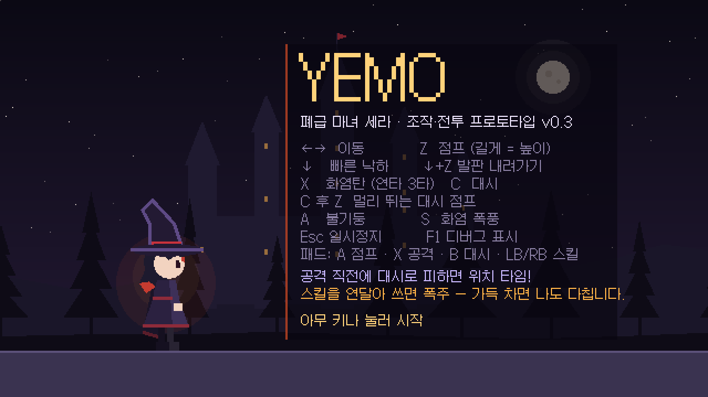
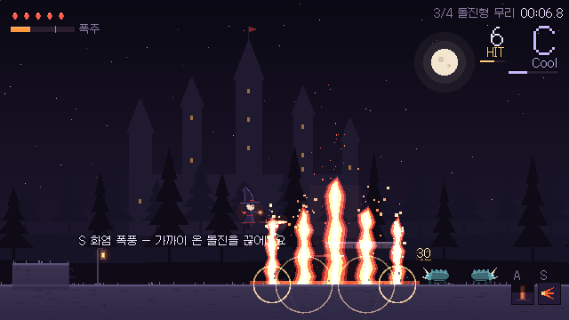
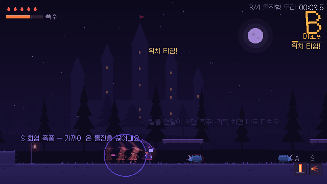
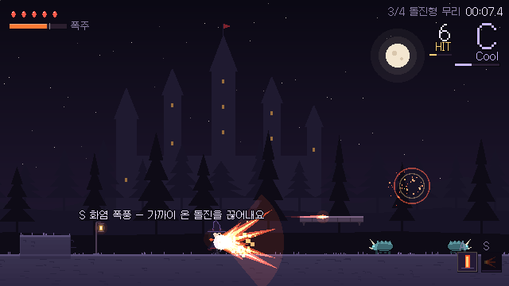
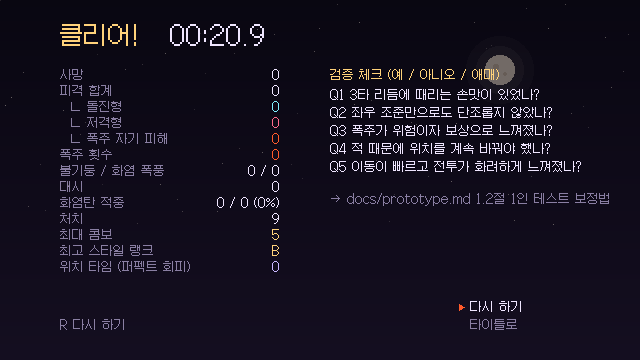

# 프로토타입 v0.3 — 빠른 이동과 스타일리시 전투

> 기획: [`prototype.md`](../prototype.md) 14절 · 실행: [`game/README.md`](../../game/README.md)
> 요청 (2026-10-03): "이동 속도·조작감·스킬의 거대함과 화려함이 부족하다. 이동이 훨씬 빠르고 전투가 스타일리시했으면 좋겠다."

---

## 1. 결과 요약

| 피드백 | 변경 | 수치 (v0.2 → v0.3) |
|---|---|---|
| 이동 속도가 느리다 | 달리기·대시·점프 전반을 Celeste 수준으로 | 달리기 7 → **11 T/s**, 대시 3 → **4.5T**, 대시 재사용 0.45 → 0.28 s |
| 조작감이 부족하다 | 대시 점프, 최고점 체공, 빠른 낙하, 발판 내려가기, 천장 모서리 보정, 대시 중 사격 | 대시 점프 약 10.8T (일반 점프 약 7.9T) |
| 스킬이 작다 | 불기둥·화염 폭풍·폭주 폭발 대형화 | 불기둥 1×4T → **2×7T + 연쇄 4줄기**, 폭풍 3 → **5.5T**, 폭발 4 → **6.5T** |
| 화려함이 부족하다 | 가산 합성 발광, 카메라 확대 펀치, 십자 섬광, 3타 폭발, 처치 히트스톱, 마지막 처치 슬로모션 | — |
| 전투가 스타일리시했으면 | **퍼펙트 회피 → 위치 타임**, **콤보·스타일 랭크(D~SS)**, 띄워 맞히기, 과열 강화 | 위치 타임: 적 시간 0.35배 1.1초 |

## 2. 조작 (추가분 굵게)

| 행동 | 키보드 | 패드 |
|---|---|---|
| 이동 / 점프 / 공격 / 대시 | ←→ / Z / X / C | 스틱 / A / X / B·RT |
| **빠른 낙하** | **공중에서 ↓** | **아래** |
| **발판 내려가기** | **통과 발판 위에서 ↓ + Z** | **아래 + A** |
| **대시 점프** | **대시 중(또는 직후) Z** | **B 후 A** |
| **퍼펙트 회피** | **공격이 닿기 직전 C** | **B** |
| 불기둥 / 화염 폭풍 | A / S | LB / RB |

## 3. 무엇을 어떻게 만들었나

### 3.1 이동 — Celeste 수치를 "타일/초"로 옮기기
Celeste는 320px 화면에 8px 타일, 이 게임은 640px 화면에 16px 타일이다. 둘 다 **화면 가로 40타일**이라 Celeste 공개 소스(`Player.cs`)의 px/s 값을 8로 나누면 그대로 "타일/초"가 된다.
- `MaxRun` 90 → 11.25 T/s → **11 T/s**
- `DashSpeed` 240 × `DashTime` 0.15 → 4.5 T → **4.5T / 0.15 s**
- `HalfGravThreshold` 40 → 5 T/s → 최고점에서 점프를 누르고 있으면 **수직 속도 ±5 T/s 안에서 중력 절반**
- `FastMaxFall`/`MaxFall` = 1.5배 → 빠른 낙하 **30 / 20 T/s**
- `SuperJumpH` 260 → 32.5 T/s는 이 게임의 좁은 전투 공간에 너무 빨라 **20 T/s**로 낮추고, 공중 감속을 따로 두어(12 T/s²) 관성이 0.75초 지속되게 했다(Celeste 0.65초).

처음에는 공중·땅 감속을 같은 값(25 T/s²)으로 두었는데, 자동 테스트에서 **대시 점프 거리가 8.7T로 일반 점프(7.9T)와 거의 같게** 나왔다. 공중 감속을 분리해 10.8T로 늘렸다.

### 3.2 퍼펙트 회피 → 위치 타임
- 대시 무적 중에 **회피 가능한 공격**과 겹치면 발동한다. 돌진형은 **돌진 중일 때만** 회피 가능(`EnemyAttackArea.dodgeable`) — 걸어 다니는 돌진형을 대시로 통과하는 것만으로 발동하면 너무 쉬워서다.
- 적만 느려지게 하는 방법: `Engine.time_scale`은 세라까지 느려지므로 쓰지 않고, `Fx.enemy_time`(0.35)을 두어 **적의 타이머·중력·AI에 곱한 시간**을 쓰고, 이동은 `velocity`에 배율을 곱해 `move_and_slide()` 한 뒤 되돌린다. 저격탄도 같은 배율로 움직인다.
- 화면 색조는 처음에 보라색 반투명 덮개(알파 0.16)를 맨 위에 올렸는데 HUD까지 뿌옇게 덮었다 → **곱하기 합성**으로 바꾸고 **HUD 아래 층**(CanvasLayer 2)으로 옮겼다.

### 3.3 콤보·스타일 랭크
- 새 오토로드 `StyleRank`(`autoload/style_rank.gd`). 처음 이름은 `Style`이었으나 기존 `Block.Style` 열거형과 이름이 겹쳐 컴파일 오류가 나서 바꿨다.
- 모든 타격은 `EnemyBase.take_hit()`을 지나므로 여기서 `StyleRank.register_hit(hit.kind, 공중 여부)`를 한 번 부르면 된다. 공격 종류는 `Hit.kind`(bolt, bolt_heavy, blast, pillar, storm, storm_final, burst).
- 다양성 보너스(최근 4타에 없던 공격 ×1.6)와 반복 감점(같은 공격 3연속 ×0.6)으로 섞어 쓰기를 유도한다. 기준 점수·배율은 기획서 14.3절.
- 타이머·감소는 **실제 시간** 기준이라 히트스톱·슬로모션 중에도 정확하다.

### 3.4 스킬 대형화와 "멈춘 화면"
- 불·폭발은 모두 `CanvasItemMaterial`의 **가산 합성**(`Fx.add_material`) — 겹칠수록 밝아져 빛나 보인다.
- 연쇄 불기둥: 중심 기둥이 솟는 순간 양옆 2.2T 간격으로 2개씩, 0.07초 간격으로 작은 기둥이 솟는다. 위치는 아래로 레이캐스트해 바닥을 찾는다.
- **문제**: 스크린샷에서 불기둥 본체가 안 보였다. 분출 0.02초 뒤(아직 40%만 솟음)에 판정 → 히트스톱(시간 0.03배) → **반쯤 솟은 순간이 멈춰** 보였던 것. 판정을 **다 솟은 0.05초 뒤**로 옮겼다. 화염 폭풍도 같은 이유로 첫 판정을 부채꼴이 다 펼쳐진 0.06초 뒤로 옮겼다.
- 불기둥 예고 중 대상 추적 속도(260 px/s)가 빨라진 돌진(272 px/s)보다 느려 빗나갔다 → 420 px/s.

## 4. 발견해서 고친 기존 버그

| 버그 | 원인 | 수정 |
|---|---|---|
| **v0.2 구간 3에 돌진형이 안 나옴** | 소환 지점을 트리거의 자식으로 두면서 레벨 좌표를 그대로 넣어, 트리거 위치(134T)만큼 더해져 **282T(레벨 밖)** 에 소환 | 씬 생성 시 부모 위치를 빼도록 수정 |
| 지연 소환 중 사망·재시작하면 고아 노드가 남음 | 소환진을 타이머 시작 전에 미리 만들어 둠 | 소환진을 타이머가 끝날 때 만들고, 타이머를 소환 지점의 자식 `Timer`로 바꿔 씬과 함께 사라지게 함 (연쇄 불기둥도 같은 방식) |

## 5. 검증

| 방법 | 결과 |
|---|---|
| 스크립트 42개 컴파일 검사 (Godot 4.7.2 헤드리스) | 실패 0 |
| 이동 수치 실측 (60 FPS 고정, 입력 자동 주입) | 최고 속도 3프레임 도달·3프레임 정지, 대시 4.5T, 점프 4.3T, 대시 점프 약 10.8T, 빠른 낙하 30 T/s, 발판 내려가기 정상 |
| 퍼펙트 회피 | 저격탄이 닿기 직전 대시 → 위치 타임 발동(적 시간 0.35, 탄 속도 1/3), 랭크 C. 대시 없이 맞으면 체력 −1·콤보·점수 초기화 |
| 전투·스타일 | 화염탄 → 불기둥 명중·연쇄 → 공중 사격으로 띄운 적 유지(약 1.5초) → 화염 폭풍: 콤보 16, 랭크 A |
| 폭주 폭발 | 게이지 100 → 경고 → 폭발, 자기 피해 1, 적 띄우기 |
| 구간 3 | 134T 통과 → 돌진형 2마리(146·154T), 150T 통과 → 추가 소환 (수정 전엔 레벨 밖) |
| 아레나 → 결과 화면 | 웨이브 1(4마리) → 웨이브 2(5마리) → 출구 → 결과 화면에 최대 콤보·최고 랭크·위치 타임 표시 |
| 5분 무작위 입력 스트레스 테스트 | 스크립트 오류 0 (사망 4, 폭주 24, 위치 타임 2회 우연 발동) |
| 웹 빌드 → 헤드리스 Chromium | 타이틀(v0.3) → 스테이지 → 화염탄·화염 폭풍·대시 점프·연쇄 불기둥 → 일시정지 정상, 콘솔 오류 0 |
| 가상 디스플레이 렌더링 스크린샷 | 이 문서의 이미지들 |

- 종료 시 `AudioStreamPlaybackWAV` 누수 경고가 나오지만 **v0.2 코드로 같은 테스트를 돌려도 똑같이 나온다**(헤드리스 오디오에서 재생 중 종료). 이번 변경과 무관.
- 자동 테스트는 프레임을 실제 시간보다 빠르게 돌리므로 **실제 시간 기준 연출(히트스톱·위치 타임 길이)은 사람이 직접 플레이해 확인해야** 한다.

## 6. 직접 플레이할 때 봐 주면 좋은 것
1. 최고 속도 11 T/s가 레벨(240T)에 비해 너무 빠르지 않은가?
2. 위치 타임이 너무 쉽게/어렵게 나오지 않는가? (돌진 직전·저격탄 직전 대시)
3. 처음 플레이에서 A 랭크 이상이 나오는가?
4. 결과 화면의 Q5 "이동이 빠르고 전투가 화려하게 느껴졌나?"

수치는 모두 `game/core/tuning.tres`에서 바꿀 수 있다.
