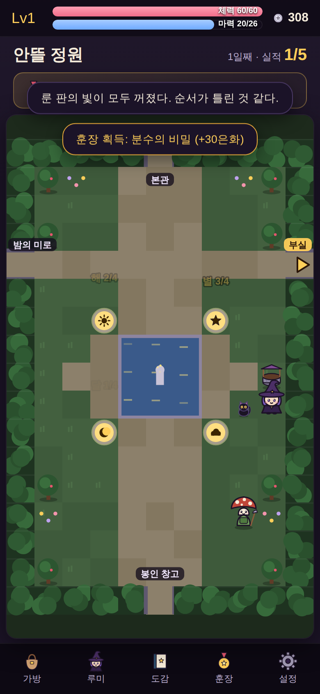
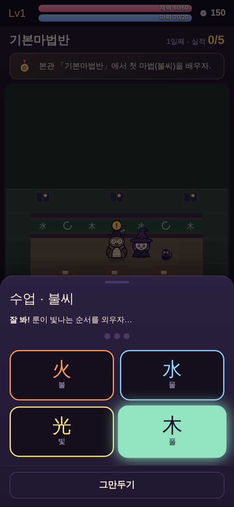
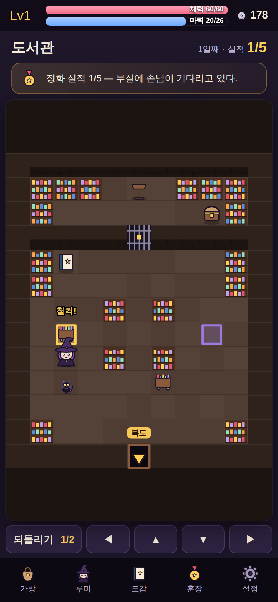
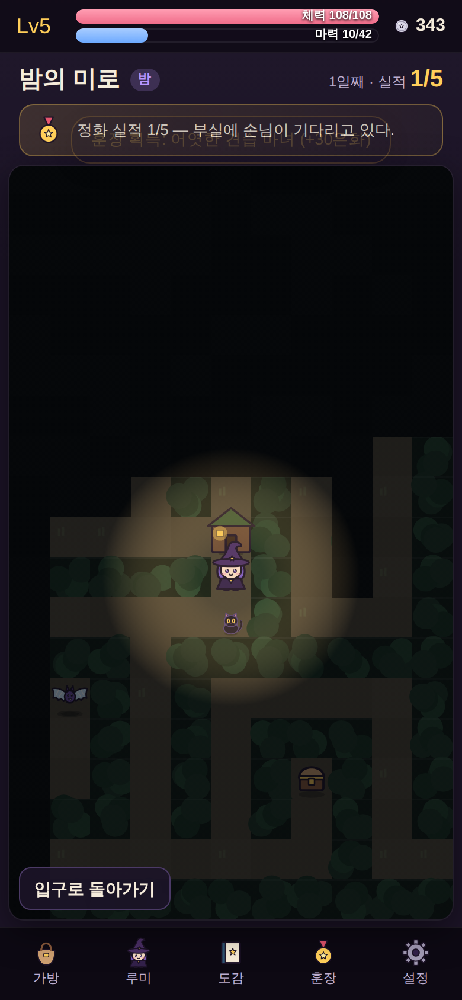
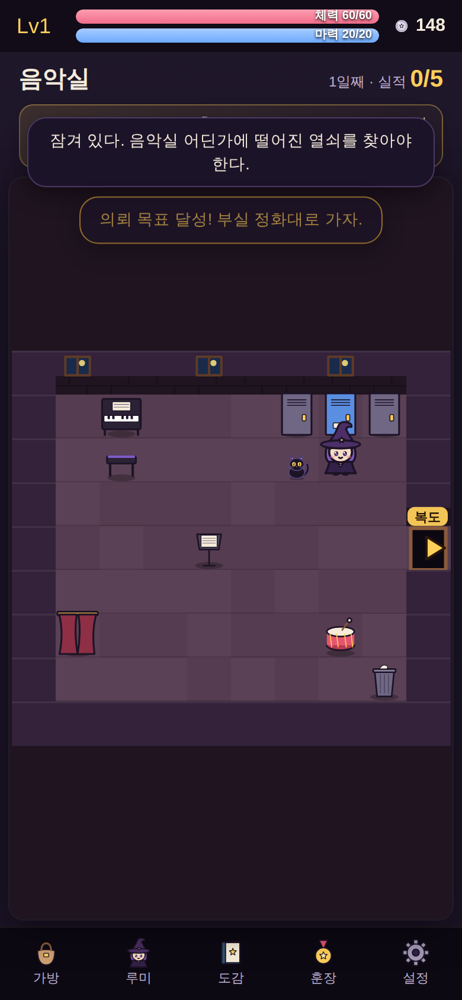
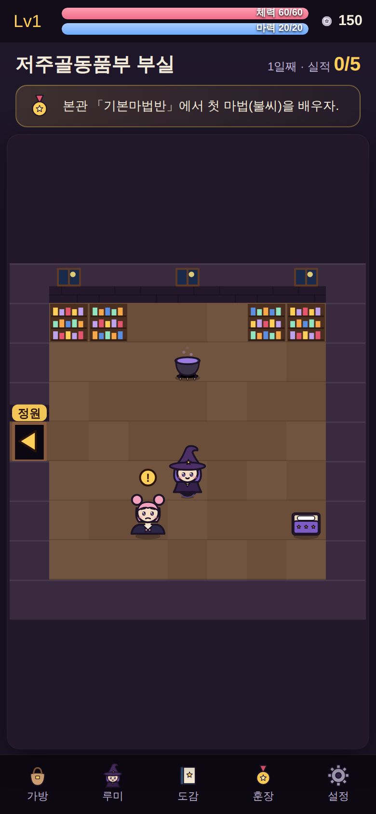
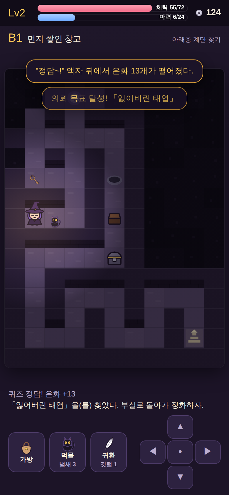
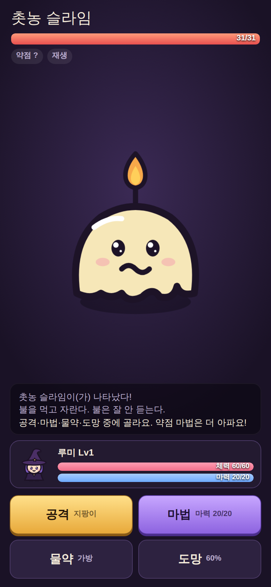
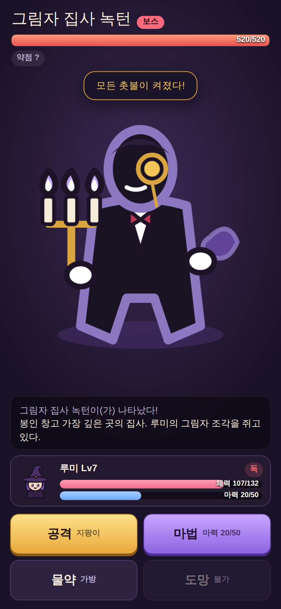

# 저주 매입합니다 — 플레이 가능한 프로토타입 v0.2

마녀학교 저주골동품부 부원 **루미**가 되어, **학교를 걸어 다니며** 교실에서 마법을 배우고, 학생들의 저주 물건을 **매입**해 학교 곳곳의 퍼즐·밤의 미로·지하 **봉인 창고**에서 해결한 뒤 **정화**해서 팔거나 장착하는 세로형 모바일 RPG 프로토타입입니다.

- 기획: [`docs/one-page.md`](../docs/one-page.md), 수치·검증: [`docs/prototype-spec.md`](../docs/prototype-spec.md)
- 형식: **HTML 한 파일** — 설치 없이 휴대폰 브라우저에서 바로 실행. (정식 엔진은 미정)

| 학교 지도(정원) | 마법 수업(룬 따라 그리기) | 도서관 책수레 밀기 |
|---|---|---|
|  |  |  |
| **밤의 미로** | **음악실(숨은 물건 찾기)** | **부실** |
|  |  |  |
| **봉인 창고(미로)** | **턴제 전투** | **보스전** |
|  |  |  |

## 플레이 방법

1. **학교 지도**에서 바닥을 탭하면 그곳까지 걸어갑니다(아르피아식). 사람·물건을 탭하면 다가가서 말을 걸거나 살펴봅니다. 문 위 이름표를 보고 다니고, **금색 이름표·화살표**가 지금 갈 곳입니다.
2. 마법은 레벨업으로 생기지 않습니다. 본관 **기본마법반**(불씨·얼음 가시·치유)과 **고급마법반**(정화의 빛·별똥비)에서 칠판 룬을 외워 같은 순서로 누르면 배웁니다. 수강료는 합격할 때만.
3. 부실에서 손님의 저주 물건을 **매입**하면 의뢰가 시작됩니다. 해결 장소는 음악실(숨은 물건 찾기)·도서관(책수레 밀기)·밤의 미로·봉인 창고.
4. 정원 분수의 룬 판, 도서관 금서 칸 상자 같은 **숨은 보상**도 있습니다.
5. 전투는 **밤의 미로**와 **봉인 창고**에서만. 메뉴형 턴제(공격 · 마법 · 물약 · 도망), 약점 마법은 더 아프고, 기를 모으는 적은 얼음 가시로 끊습니다.
6. 의뢰를 마치면 부실 **정화대**에서 정화 → 판매하거나 장신구로 장착합니다. 부실 **침대**에서 자면 하루가 지납니다.
7. 정화 실적 **5건** + B5의 **그림자 집사 녹턴** 격파 → 엔딩(이후 자유 탐험).

진행은 브라우저(localStorage)에 자동 저장됩니다. (v0.1 저장 데이터는 구조가 달라 이어하기가 되지 않습니다 — 새로 시작)

## 실행

- 바로 실행: `dist/index.html` 을 브라우저로 엽니다. (휴대폰은 파일을 내려받아 열거나, 아무 정적 호스팅에 올려 링크로 엽니다.)
- 다시 빌드: `node prototype/build.cjs` → `dist/index.html`(단독 실행), `dist/artifact.html`(아티팩트 게시용)

## 구조

| 파일 | 내용 |
|---|---|
| `src/data.js` | 게임 데이터: 아이템·골동품·몬스터·층·의뢰·대사·훈장·퀴즈·조정값 |
| `src/rules.js` | 규칙(화면과 분리): 미로 생성, 이동·시야, 전투, 의뢰, 마법 수업, 상점, 경제, 저장 |
| `src/world.js` | 학교 지도 규칙(화면과 분리): 구역 8개 지형·출입구·물체, 길 찾기, 필드 퍼즐 4종, 밤의 미로 생성, 목표 안내 |
| `src/art.js` | 그래픽: 캐릭터·몬스터·아이템·타일을 코드로 그림(외부 이미지 없음) |
| `src/ui.js` | 화면·흐름: 타이틀, 부실, 매점, 양호실, 봉인 창고, 전투, 촛불 퍼즐, 대화, 엔딩 |
| `src/field.js` | 학교 지도 화면: 걷기·카메라·구역 그림, 상호작용, 마법 수업 미니게임 |
| `src/audio.js` | 효과음(Web Audio 합성음) |
| `src/style.css` | 스타일 |
| `build.cjs` | 위 파일을 HTML 한 파일로 합침 |

## 테스트

```bash
node --test prototype/tests/rules.test.cjs   # 규칙 단위 테스트 36개
node prototype/tests/simulate.cjs 200        # 봇이 처음부터 엔딩까지 200판 (밸런스)
node prototype/tests/battle-sim.cjs          # 레벨별 보스·몬스터 승률
node prototype/tests/e2e.cjs [--small]       # 모바일 브라우저 E2E + 스크린샷 (Playwright 필요)
node prototype/tests/e2e-full.cjs [시드]     # 실제 UI를 조작해 엔딩까지 완주 (Playwright 필요)
node prototype/tests/e2e-field.cjs [--small] # 학교 지도를 실제 탭으로 걸으며 수업·퍼즐·미로 25항목 확인
```

E2E 스크립트는 전역 설치된 Playwright(`/opt/node22/lib/node_modules/playwright`)를 사용합니다. 다른 환경에서는 그 경로를 `playwright`로 바꿔 쓰면 됩니다.
